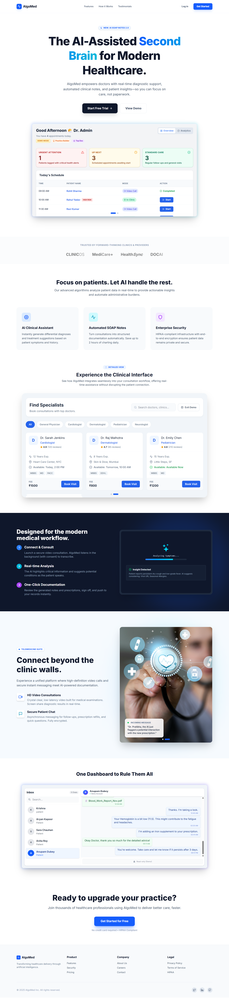
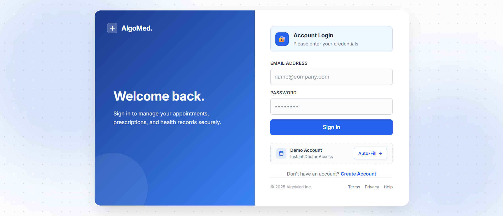
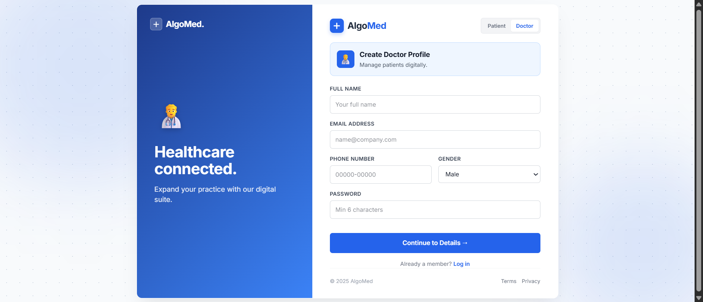
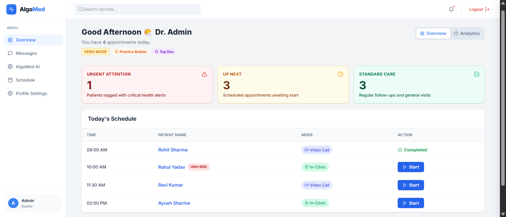
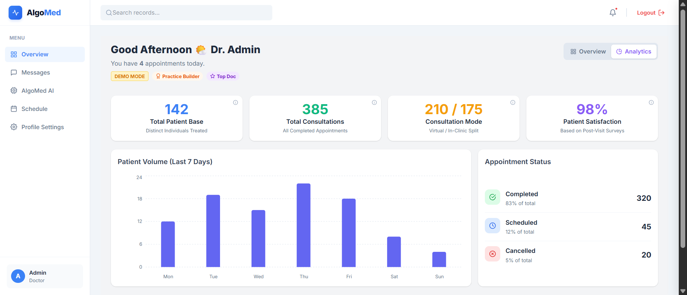
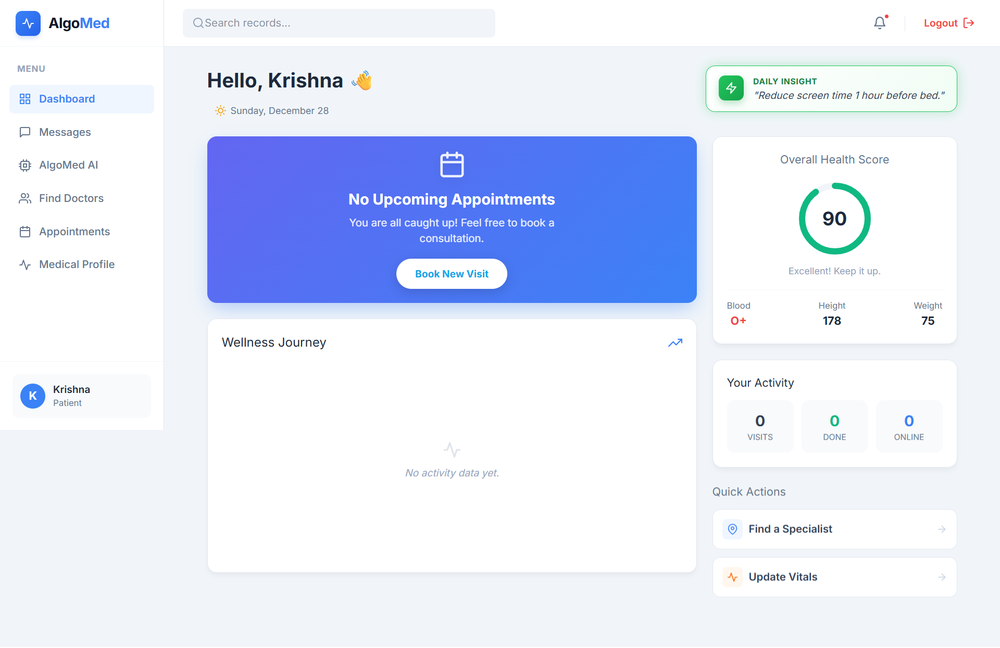
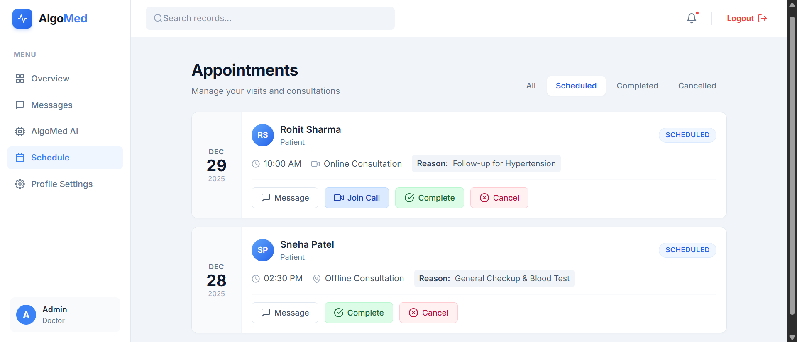
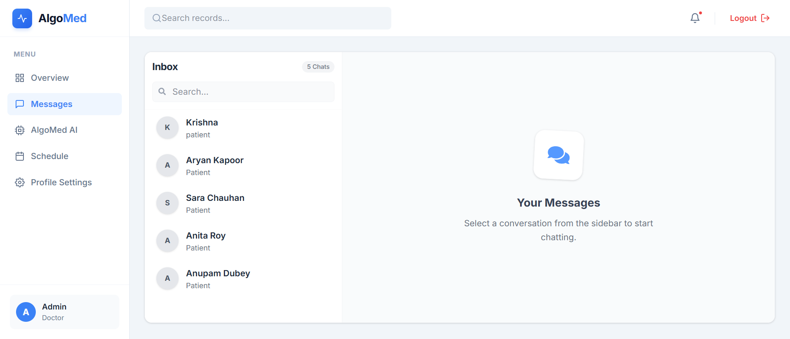
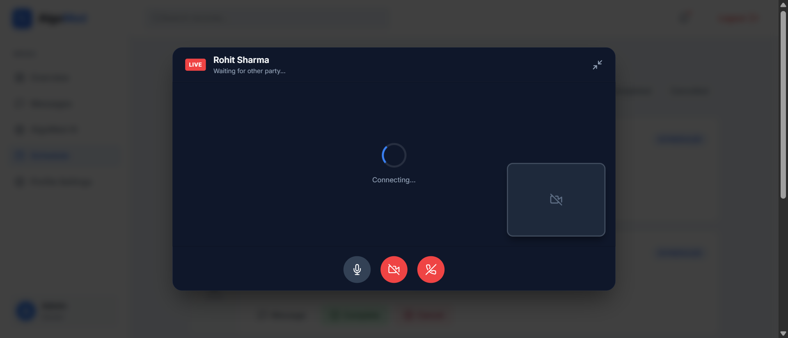
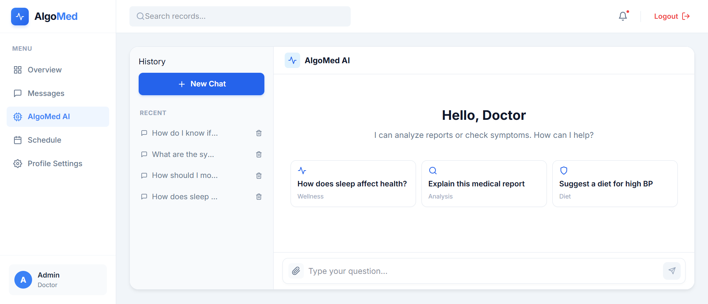

# AlgoMed - AI-Powered Telemedicine & Clinical Assistant Platform


## 🏥 Overview

**AlgoMed** is a comprehensive healthcare platform designed to bridge the gap between patients and doctors using modern web technologies and Artificial Intelligence. Beyond standard appointment booking, AlgoMed acts as a "Second Brain" for healthcare providers.

It features **Real-time Video Consultations** (custom WebRTC implementation), **Instant Messaging**, and an **AI Clinical Assistant** that automatically generates structured **SOAP notes** (Subjective, Objective, Assessment, Plan) from consultation transcripts, significantly reducing administrative burnout for doctors.


## ✨ Key Features

### 🤖 AI-Driven Healthcare (Powered by Google Gemini)
* **Automated SOAP Notes:** Analyzes raw doctor notes or consultation transcripts to generate professional, structured clinical documentation (JSON format) with ICD-10 suggestions.
* **AI Chat Assistant:** A context-aware chatbot for patients to analyze medical reports, check symptoms, and get wellness advice.
* **Medical Report Analysis:** Users can upload images/PDFs of reports for AI-driven summarization and explanation.

### 📹 Real-Time Communication
* **HD Video Telemedicine:** Integrated video calling using **WebRTC** signaling via Socket.io. Supports peer-to-peer connection establishment (Offer/Answer/ICE Candidates).
* **Live Chat:** Real-time messaging between doctors and patients with persistent history stored in MongoDB.

### 🩺 Doctor Dashboard
* **Patient Snapshot:** Quick view of patient history and upcoming appointments.
* **Appointment Management:** Accept, reject, or reschedule appointments.
* **Profile Management:** customizable professional profiles visible to patients.

### 👤 Patient Portal
* **Find Doctors:** Search and filter doctors by specialization.
* **Appointment Booking:** Seamless booking interface.
* **Medical History:** Secure access to past appointments and chat history.

### 🔐 Security & Architecture
* **Role-Based Access Control (RBAC):** Middleware protected routes ensuring strict separation between Patient, Doctor, and Admin scopes.
* **JWT Authentication:** Secure stateless authentication with HttpOnly cookies (where applicable) and local storage.


## 🛠️ Tech Stack

### Frontend
* **Framework:** React 19 (Vite)
* **Styling:** Tailwind CSS v4, PostCSS
* **State Management:** React Context API (AuthContext)
* **Routing:** React Router DOM v7
* **HTTP Client:** Axios
* **Real-time Client:** Socket.io-client

### Backend
* **Runtime:** Node.js
* **Framework:** Express.js
* **Database:** MongoDB (via Mongoose)
* **AI Engine:** Google Generative AI SDK (Gemini)
* **Real-time Server:** Socket.io
* **Authentication:** JSON Web Tokens (JWT), bcryptjs
* **File Storage:** Cloudinary (report analysis)


## 📸 Screenshots

### 🏠 Landing Page


### 🔐 Authentication (Login)


### 🔐 Authentication (Signup)


### 🧑‍⚕️ Doctor Dashboard




### 🧑‍⚕️ Patient Dashboard


### 📅 Appointment Management


### 💬 Real-Time Chat


### 💬 Real-Time Video Call


### 💬 AlgoMed AI


------


## 📁 Project Structure

```
AlgoMed-MERN/
│
├── Backend/
│   ├── config/            # DB configuration
│   ├── controllers/       # API logic
│   ├── middleware/        # Auth & role guards
│   ├── models/            # MongoDB schemas
│   ├── routes/            # API routes
│   └── server.js
│
├── Frontend/
│   ├── src/
│   │   ├── components/
│   │   ├── pages/
│   │   ├── context/
│   │   ├── services/
│   │   └── main.jsx
│   └── index.html
│
└── README.md
```

---

## ⚙️ Installation & Setup

### 1️⃣ Clone the Repository

```bash
git clone https://github.com/krishnna05/AlgoMed.git
cd AlgoMed
```

---

### 2️⃣ Backend Setup

```bash
cd Backend
npm install
```

Create a `.env` file:

```env
PORT=5000
MONGO_URI=your_mongodb_connection_string
JWT_SECRET=your_secret_key
```

Run backend:

```bash
npm run dev
```

---

### 3️⃣ Frontend Setup

```bash
cd ../Frontend
npm install
npm run dev
```

Frontend runs at:

```
http://localhost:5173
```

Backend runs at:

```
http://localhost:5000
```

---

## 🔒 API Authentication Flow

* JWT stored in localStorage
* Auth middleware verifies token
* Role middleware restricts doctor/patient routes

---

## 📌 Future Enhancements

* Online payment gateway
* AI-based symptom checker
* Push notifications

---

## 🤝 Contributing

Contributions are welcome!
Fork the repository, create a feature branch, and submit a pull request.

---

## 📄 License

This project is licensed under the **MIT License**.

---

## 👨‍💻 Author

**Krishna Vishwakarma**
Full Stack Developer | MERN | AI in Healthcare
🔗 GitHub: [https://github.com/krishnna05](https://github.com/krishnna05)

